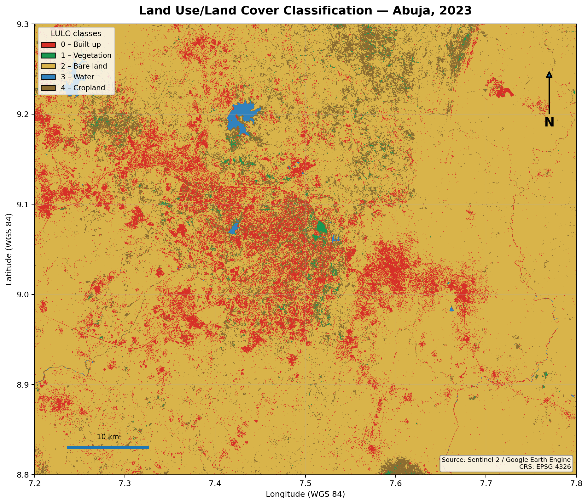
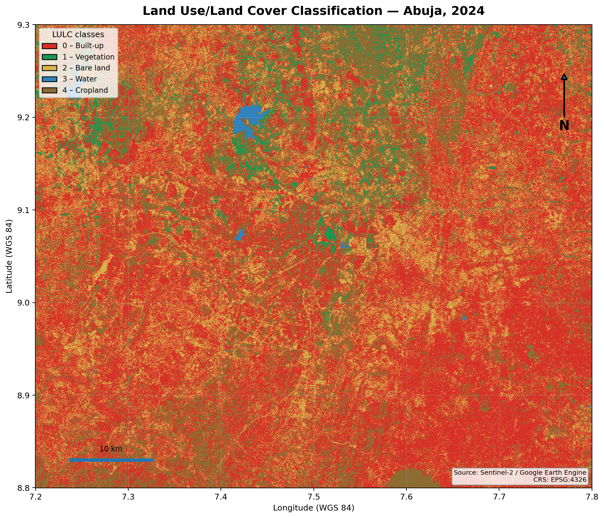
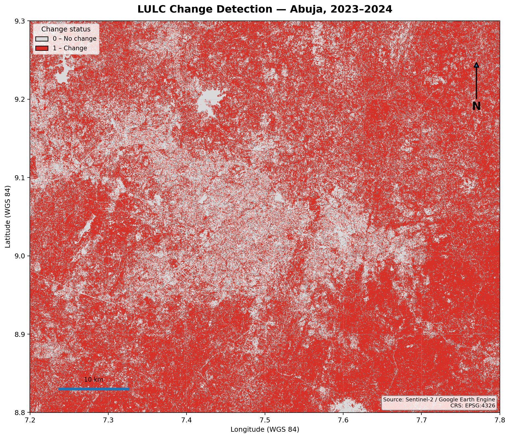
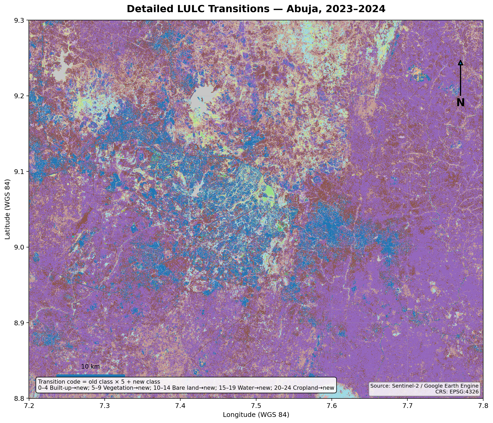
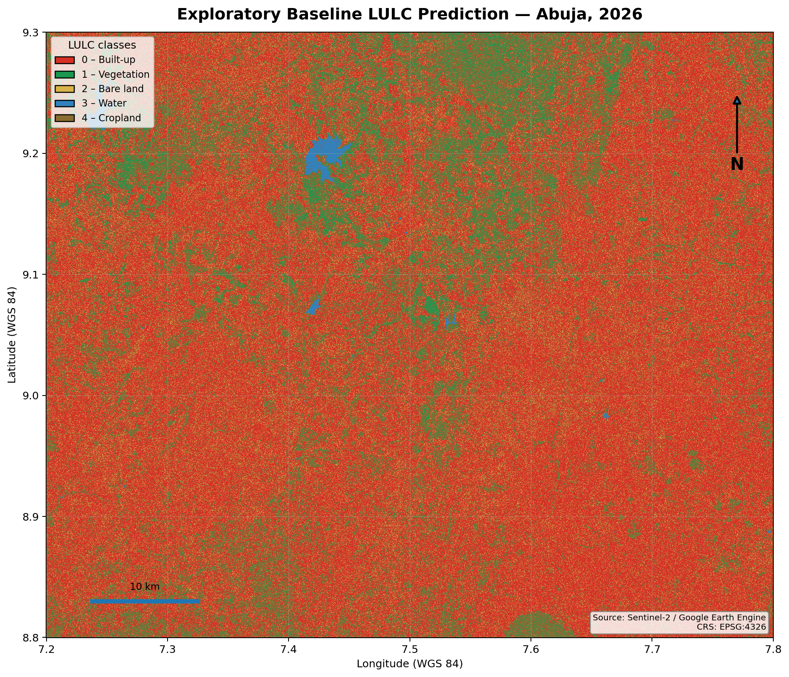

# Abuja-LULC-ML

## Spatiotemporal Analysis and Machine Learning-Based Prediction of Land Use/Land Cover Change in Abuja, Nigeria Using Sentinel-2 Data

An end-to-end **GeoAI and remote-sensing workflow** for mapping land use/land cover (LULC), quantifying change, analysing class transitions, and exploring machine-learning-based future land-cover patterns in Abuja, Nigeria.

---

## Project at a Glance

| Component | Implementation |
|---|---|
| Study area | Abuja, Federal Capital Territory, Nigeria |
| Satellite data | Sentinel-2 Surface Reflectance Harmonized |
| Analysis years | 2023 and 2024 |
| Baseline projection | Exploratory 2026 scenario |
| Spectral predictors | B2, B3, B4, B8, B11, B12 + NDVI, NDWI, NDBI, BSI, SAVI |
| Classification | Random Forest |
| Change analysis | Pixel-based change detection and 25-state transition analysis |
| Transition modelling | Random Forest |
| Processing platform | Google Earth Engine |
| GIS / visualization | QGIS and GitHub |
| Main outputs | Classified rasters, change map, transition map, area statistics, transition probabilities, validation results |

---

## Project Overview

This project investigates land use and land cover (LULC) patterns and changes in Abuja, Nigeria, using Sentinel-2 satellite imagery, Geographic Information Systems (GIS), remote sensing, and machine learning.

The study:

- classifies land cover for 2023 and 2024;
- assesses classification accuracy using internal pixel-based validation;
- quantifies mapped area by LULC class;
- detects mapped changes between 2023 and 2024;
- analyses all 25 possible class-to-class transitions;
- calculates transition probabilities;
- evaluates a Random Forest transition model; and
- produces an exploratory 2026 baseline projection.

> **Interpretation note:** Large differences in mapped class area are classification-derived results. They should not automatically be interpreted as confirmed physical land conversion without additional independent spatial or field validation.

---

## Map Gallery

The five principal map products are shown below. Each preview links to its corresponding GIS-ready GeoTIFF.

### 2023 LULC Classification

**2023 classification:** Sentinel-2-based Random Forest LULC map.

[View/download the 2023 GeoTIFF](maps/LULC_2023/Abuja_LULC_Classification_2023.tif) · [Open the 2023 map folder](maps/LULC_2023/)

---

### 2024 LULC Classification

**2024 classification:** Sentinel-2-based Random Forest LULC map.

[View/download the 2024 GeoTIFF](maps/LULC_2024/Abuja_LULC_Classification_2024.tif) · [Open the 2024 map folder](maps/LULC_2024/)

---

### 2023–2024 Change Detection

**Change detection:** pixels classified as changed or unchanged between the 2023 and 2024 LULC maps.

[View/download the change-detection GeoTIFF](maps/change_detection/Abuja_LULC_Change_2023_2024.tif) · [Open the change-detection folder](maps/change_detection/)

---

### 2023–2024 LULC Transition Analysis

**Transition analysis:** spatial distribution of class-to-class LULC transitions between 2023 and 2024.

[View/download the transition GeoTIFF](maps/transition_analysis/Abuja_LULC_Transitions_2023_2024.tif) · [Open the transition-analysis folder](maps/transition_analysis/)

---

### Exploratory 2026 Baseline Projection

**2026 baseline:** exploratory spatial allocation based on observed 2023→2024 transition probabilities.

[View/download the 2026 GeoTIFF](maps/prediction_2026/Abuja_LULC_2026_Baseline_Prediction.tif) · [Open the 2026 map folder](maps/prediction_2026/)

> **Important:** The 2026 product is an exploratory baseline scenario, not a validated forecast.

---

## Research Objectives

1. Classify land use and land cover in Abuja using Sentinel-2 satellite imagery.
2. Analyze land cover changes between 2023 and 2024.
3. Produce land cover area statistics and a transition matrix.
4. Investigate machine learning approaches for modelling land cover transitions.
5. Produce an exploratory baseline projection for 2026.
6. Maintain a reproducible geospatial workflow using Google Earth Engine.

---

## Study Area

The study focuses on **Abuja, Federal Capital Territory, Nigeria**.

The analysis uses a consistent study-area extent and comparable January–April seasonal windows for 2023 and 2024.

---

## Land Cover Classes

| Class | Land Cover |
|---:|---|
| 0 | Built-up |
| 1 | Vegetation |
| 2 | Bare land |
| 3 | Water |
| 4 | Cropland |

---

## Data and Tools

### Data

- Sentinel-2 Surface Reflectance Harmonized imagery
- Land-cover training polygons
- Pixel-based training and validation samples

### Software and platforms

- Google Earth Engine
- JavaScript
- QGIS / GIS
- GitHub

### Spectral predictors

- B2 — Blue
- B3 — Green
- B4 — Red
- B8 — Near Infrared
- B11 — SWIR 1
- B12 — SWIR 2
- NDVI — Normalized Difference Vegetation Index
- NDWI — Normalized Difference Water Index
- NDBI — Normalized Difference Built-up Index
- BSI — Bare Soil Index
- SAVI — Soil Adjusted Vegetation Index

---

## Methodology

The main workflow is:

1. Define the Abuja study area.
2. Acquire and filter Sentinel-2 imagery for comparable seasonal periods.
3. Prepare spectral bands and remote-sensing indices.
4. Create land-cover training polygons.
5. Train Random Forest classifiers for 2023 and 2024.
6. Assess classification accuracy.
7. Calculate LULC area statistics.
8. Generate change-detection and detailed transition outputs.
9. Calculate transition probabilities.
10. Train and evaluate a transition Random Forest model.
11. Produce an exploratory 2026 baseline projection.

The complete Google Earth Engine implementation is available in [gee/Abuja_LULC_Classification.js](gee/Abuja_LULC_Classification.js).

---

## Classification Accuracy

Two internal validation approaches were implemented.

### Initial random-split validation

| Year | Overall Accuracy | Kappa |
|---|---:|---:|
| 2023 | 97.07% | 0.963 |
| 2024 | 98.80% | 0.985 |

### Holdout validation

| Year | Samples | Training | Validation | Overall Accuracy | Kappa |
|---|---:|---:|---:|---:|---:|
| 2023 | 1,271 | 1,035 | 236 | 97.03% | 0.962 |
| 2024 | 1,271 | 1,004 | 267 | 98.13% | 0.976 |

These are **internal pixel-based validation results**. They should not be interpreted as fully independent spatial or field validation because the samples were derived from the same general training-polygon framework.

---

## Area Statistics

| Year | Class | Area (km²) | Percentage |
|---|---|---:|---:|
| 2023 | Built-up | 380.5670 | 10.4323% |
| 2023 | Vegetation | 15.1942 | 0.4165% |
| 2023 | Bare land | 2990.8557 | 81.9868% |
| 2023 | Water | 15.1457 | 0.4152% |
| 2023 | Cropland | 246.2086 | 6.7492% |
| 2024 | Built-up | 1928.6668 | 52.8696% |
| 2024 | Vegetation | 122.8571 | 3.3678% |
| 2024 | Bare land | 760.1422 | 20.8374% |
| 2024 | Water | 15.2096 | 0.4169% |
| 2024 | Cropland | 821.0955 | 22.5083% |

The mapped LULC composition changes substantially between the two classified years. These results describe classification outputs and should not by themselves be interpreted as confirmed physical land conversion.

The complete area table is available at [results/area_statistics/LULC_Area_Statistics.csv](results/area_statistics/LULC_Area_Statistics.csv).

---

## Transition Analysis

The transition matrix contains all 25 possible class-to-class transitions between 2023 and 2024.

The largest mapped transition is **Bare land → Built-up**, with approximately **1,592.82 km²**. The next largest is **Bare land → Cropland**, with approximately **633.73 km²**.

The transition-area matrix and transition-probability matrix are available in [results/transition_matrix/](results/transition_matrix/).

---

## Transition Machine Learning

A Random Forest transition model was trained using 2023 predictor information and 2024 observed LULC as the target.

- Training samples: 1,982
- Validation samples: 518
- Overall accuracy: 70.27%
- Kappa: 0.628

The transition model is less accurate than the individual-year LULC classifiers and is therefore treated as an **exploratory modelling experiment** rather than a definitive forecasting model.

---

## 2026 Baseline Projection

A Markov-style baseline projection was generated from the observed 2023→2024 transition probabilities and spatial allocation.

This is an **exploratory baseline scenario**, not a validated forecast. It should be interpreted as a continuation-of-transition-patterns experiment rather than a guaranteed representation of future land cover.

---

## Repository Structure

    Abuja-LULC-ML/
    ├── README.md
    ├── gee/
    │   └── Abuja_LULC_Classification.js
    ├── maps/
    │   ├── LULC_2023/
    │   │   ├── Abuja_LULC_Classification_2023.tif
    │   │   ├── Abuja_LULC_Classification_2023_preview.png
    │   │   └── README.md
    │   ├── LULC_2024/
    │   │   ├── Abuja_LULC_Classification_2024.tif
    │   │   ├── Abuja_LULC_Classification_2024_preview.png
    │   │   └── README.md
    │   ├── change_detection/
    │   │   ├── Abuja_LULC_Change_2023_2024.tif
    │   │   ├── Abuja_LULC_Change_2023_2024_preview.png
    │   │   └── README.md
    │   ├── transition_analysis/
    │   │   ├── Abuja_LULC_Transitions_2023_2024.tif
    │   │   ├── Abuja_LULC_Transitions_2023_2024_preview.png
    │   │   └── README.md
    │   └── prediction_2026/
    │       ├── Abuja_LULC_2026_Baseline_Prediction.tif
    │       ├── Abuja_LULC_2026_Baseline_Prediction_preview.png
    │       └── README.md
    ├── results/
    │   ├── accuracy/
    │   ├── area_statistics/
    │   └── transition_matrix/
    └── documentation/
        ├── PROJECT_OVERVIEW.md
        ├── METHODOLOGY.md
        ├── MAPS_AND_DATA.md
        └── RESULTS_INTERPRETATION.md

---

## Documentation and Data

### Core documentation

- [Project overview](documentation/PROJECT_OVERVIEW.md)
- [Methodology](documentation/METHODOLOGY.md)
- [Maps and data products](documentation/MAPS_AND_DATA.md)
- [Results interpretation](documentation/RESULTS_INTERPRETATION.md)

### Results

- [Classification accuracy](results/accuracy/LULC_Accuracy_Assessment.csv)
- [LULC area statistics](results/area_statistics/LULC_Area_Statistics.csv)
- [Transition matrix](results/transition_matrix/LULC_Transition_Matrix_2023_2024.csv)
- [Transition probabilities](results/transition_matrix/LULC_Transition_Probabilities_2023_2024.csv)

### Processing code

- [Google Earth Engine workflow](gee/Abuja_LULC_Classification.js)

---

## Map Data Products

The repository contains five principal GeoTIFF products. These are the GIS-ready raster data products and can be opened in QGIS, ArcGIS, or other geospatial software.

| Product | GeoTIFF | Preview |
|---|---|---|
| 2023 LULC classification | [GeoTIFF](maps/LULC_2023/Abuja_LULC_Classification_2023.tif) | [PNG preview](maps/LULC_2023/Abuja_LULC_Classification_2023_preview.png) |
| 2024 LULC classification | [GeoTIFF](maps/LULC_2024/Abuja_LULC_Classification_2024.tif) | [PNG preview](maps/LULC_2024/Abuja_LULC_Classification_2024_preview.png) |
| 2023–2024 change detection | [GeoTIFF](maps/change_detection/Abuja_LULC_Change_2023_2024.tif) | [PNG preview](maps/change_detection/Abuja_LULC_Change_2023_2024_preview.png) |
| 2023–2024 transition analysis | [GeoTIFF](maps/transition_analysis/Abuja_LULC_Transitions_2023_2024.tif) | [PNG preview](maps/transition_analysis/Abuja_LULC_Transitions_2023_2024_preview.png) |
| 2026 baseline projection | [GeoTIFF](maps/prediction_2026/Abuja_LULC_2026_Baseline_Prediction.tif) | [PNG preview](maps/prediction_2026/Abuja_LULC_2026_Baseline_Prediction_preview.png) |

> **Viewing note:** GitHub does not provide an interactive GeoTIFF map viewer in the repository interface. The PNG previews provide quick visual inspection, while the GeoTIFF files should be opened in QGIS, ArcGIS, or another GIS application for full raster analysis.

---

## Limitations

- Validation is based on pixel samples derived from the training-polygon framework rather than independent field observations.
- The 2026 projection is exploratory and has not been validated against future observed land cover.
- Classification results can be affected by training-sample quality, spectral similarity, seasonal differences, and image conditions.
- A longer time series would provide a stronger basis for temporal modelling.
- Future work can incorporate independent spatial validation and additional explanatory variables such as roads, elevation, population, and protected areas.
- The large differences in mapped class areas between 2023 and 2024 require careful interpretation because spectral confusion between land-cover classes can influence classification-derived change.

---

## Future Work

- Add additional Sentinel-2 years to strengthen temporal analysis.
- Perform independent spatial and temporal validation.
- Test additional machine-learning and deep-learning models.
- Incorporate explanatory variables such as roads, elevation, population, and accessibility.
- Develop a more spatially explicit prediction framework.
- Compare multiple classification algorithms and feature combinations.
- Develop an interactive visualization dashboard.
- Investigate class-confusion patterns, particularly between spectrally similar surfaces such as bare land and built-up areas.

---

## Project Significance

The project demonstrates an end-to-end GeoAI workflow combining:

**Remote Sensing → GIS → Spectral Feature Engineering → Random Forest Classification → Accuracy Assessment → Change Detection → Transition Analysis → Machine Learning Transition Modelling → Exploratory Prediction**

The repository is intended to provide a reproducible research and portfolio record of the workflow, intermediate results, final raster products, and methodological documentation.

---

## Author

**Chima Okwandu**

GitHub: [Chima-design1](https://github.com/Chima-design1)

---

## Citation

If you use or reference this project, please cite the repository and associated research work appropriately.
